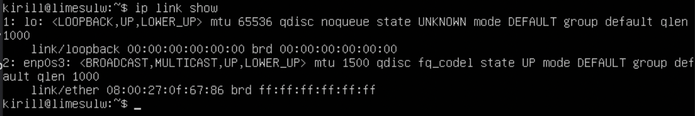
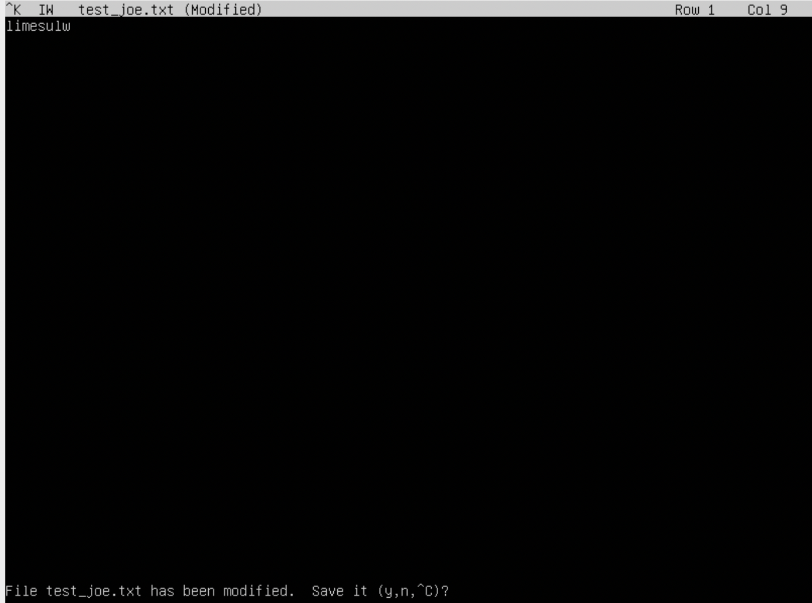

## Part 1. Установка ОС

- Образ системы был скачан с сайта https://releases.ubuntu.com/20.04/
- Вывод названия системы с помощью команды `cat /etc/issue`

 
## Part 2. Создание пользователя

- Создан новый пользователь _user2_

- Новый пользователь добавлен в группу adm

- Отображение команды `cat /etc/passwd`

## Part 3. Настройка сети ОС

- Команды для смены машины на user-1

`sudo vim /etc/hostname`
`sudo reboot`

- Установка временной зоны, соответсвующей местоположению

- Вывод названий сетевых интерфейсов

> Интерфейс lo по-другому называется loopback или обратная
> петля. Он используется для отладки сетевых программ и запуска
> серверных приложений на локальной машине. С этим интерфейсом
> всегда связан адрес 127.0.0.1. У него есть dns-имя –
> localhost.

- Получение ip адреса устройства с помощью команды `ip r`

> Для работы по сети любому устройству требуется IP-адрес.
> В протоколе IPv4 это числовой идентификатор, состоящий из 4 разрядов, каждый из
> которых отделяется точкой, без него устройство не может быть определено в сетевой
> инфраструктуре. Прикладной протокол DHCP выполняет всю работу по подбору сетевых
> настроек автоматически, без необходимости присваивать вручную каждому устройству
> свой IP-адрес. Это очень упрощает работу системного администратора в случае
> расширения сети.

- Вывод внешнего ip-адреса шлюза (ip) и внутреннего IP-адреса шлюза, он же ip-адрес по умолчанию (gw).

- Задать статичные (заданные вручную, а не полученные от DHCP сервера) настройки ip, gw, dns (использовать публичный DNS серверы, например 1.1.1.1 или 8.8.8.8)

> sudo vim /etc/netplan/00-installer-config.yaml

- Принятие внесенных изменений `sudo netplan apply`
- Делаем перезагрузку...
- Вывод после ребута ip адреса устройства с помощью команды `ip r`
- Пингование удаленных хостов `1.1.1.1` и `ya.ru`

## Part 4. Обновление ОС

- Команда для получения пакетов для обновления: `sudo apt update`
- Команда для установки пакетов для обновления: `sudo apt upgrade`
- Команда для получения и установки пакетов для обновления: `sudo apt-get dist-upgrade`

## Part 5. Использование команды sudo

- Использование команды для создания пароля _user2_ `sudo passwd user2`
- Использование команды `sudo usermod -aG sudo user` для наделения _user2_ правами суперпользователя
- Использование команды `su` для переключения между пользователями `su user2`
- Использование команды `sudo hostnamectl set-hostname joke` для смены _hostname_
- Использование команды `hostname` от _user2_ для просмотра права сменить _hostname_

> Команда sudo дает право пользователю вносить любые изменение в
> систему. По-другому дает права суперпользователя.

## Part 6. Установка и настройка службы времени

- Установка службы автоматической синхронизации времени `ntp`

- Определение сервера времени с помощью команды `ntpdate pool.ntp.org`

##Part 7. Установка и использование текстовых редакторов

- Установка текстовых редакторов vim, nano, joe

- Создание файла в _nano_ с названием _test_nano.txt_ печать ника и выход с сохранением `ctrl+x` -> `y`

- Создание файла в _vim_ с названием _test_vim.txt_ печать ника и выход с сохранением -> `i`, `esc` -> `:` -> `wq`

- Создание файла в _joe_ с названием _test_joe.txt_ печать ника и выход с сохранением `ctrl+K+Q`, -> `y`

- Редактирование файла в _nano_ замена **armorcoo** на **21 School 21** и выход без сохранения `cnt+x` -> `n`

- Редактирование файла в _vim_ замена **armorcoo** на **21 School 21** и выход без сохранения `i`, `esc` -> `q!`

- Редактирование файла в _joe_ замена **armorcoo** на **21 School 21** и выход без сохранения `ctrl+c` -> `y`

- Поиск с заменой в _nano_ `ctrl+\` -> `...` -> `...` -> `enter`

- Поиск с заменой в _vim_ `:s/.../...`

- Поиск с заменой в _joe_ `ctrl+k+f` -> `r` -> `...` -> `...` `y`

## Part 8. Установка и базовая настройка сервиса SSHD

- Установка службы sshd с помощью команды `sudo apt install openssh-server`

- Добавление автостарта службы при запуске системы с помощью команды `sudo systemctl enable ssh`

- Перенастройка службы sshd на порт 2022
  ⋅⋅⋅ Открываем файл конфигурации с помощью команды `sudo vim /etc/ssh/sshd_config`
  ⋅⋅⋅ Раскомменитируем строчку _Port 22_ и изменяем на _Port 2022_

⋅⋅⋅ Перезапускаем службу _sshd_ с помощью команды `sudo systemctl restart ssh` и проверяем значение порта с помощью команды `netstat -tan`

- Вызов команды `ps -C sshd` для показа наличия процесса _sshd_

> Команда ps выводит список текущих процессов.
> | Опции | Действие |
> | ------------: | ------------------ |
> | -A, -e, | выбрать все процессы|
> | -a | выбрать все процессы, кроме фоновых |
> | -d | выбрать все процессы, кроме процессов сессий |
> | -N | выбрать все процессы кроме указанных|
> | -C | выбирать процессы по имени команды|
> | -G | выбрать процессы по ID группы|
> | -p | выбрать процессы PID|
> | --pid | выбрать процессы по PID родительского процесса|
> | -s | выбрать процессы по ID сессии|
> | -t | выбрать процессы по tty|
> | -u | выбрать процессы пользователя|

- Подробнее про `netstat` и `netstat -tan`
  > Команда `netstat` работает вместе с командой `ifconfig` и служит для отображения состояния сетевого интерфейса _TCP/IP_.
  > `netstat -tan` Отображает все соединения, связанные с TCP, и не выполняет разрешение имен

## Part 9. Установка и использование утилит top, htop

- Установка и запуск утилит `htop`, `top`

| top/htop | Отчет |
| ------------: | ------------------ |
| uptime | 08:16:23 |
| кол-во авториз. юзеров | 1 user |
| общая загрузка системы | 0.2% |
| общее кол-во проц-ов | 94 |
| загрузка cpu | 0,0% |
| загрузка памяти | 0.2% |
| pid процес. занимающего больше всего памяти | 1 |
| pid процес. занимающего больше всего процес. времени | 1 |

- сортировка содержимого по PID, PERCENT_CPU, PERCENT_MEM, TIME

- сортировка содержимого для процесса sshd, с процессом syslog, с добавленным выводом hostname, clock и uptime

## Part 10. Использование утилиты fdisk

- /dev/sda 10 Gib, 20971520 sectors
- Disk model VBOX HARDISK
- Swap: 0B

## Part 11. Использование утилиты df

- Выполнение команды `df`
  ⋅⋅⋅ размер раздела (/) `8408452 = 8.1GB`
  ⋅⋅⋅ размер занятого пространства `4655092 = 4.5GB`
  ⋅⋅⋅ размер свободного пространства `3304644 =3.2GB`
  ⋅⋅⋅ процент использования `59%`
  ⋅⋅⋅ единица измерения - блоки по 1 килобайту и гигабайту

- Выполнение команды `df -Th`

⋅⋅⋅ размер раздела (/) `8.1GB`
⋅⋅⋅ размер занятого пространства `4.5GB`
⋅⋅⋅ размер свободного пространства `3.2GB`
⋅⋅⋅ процент использования `59%`
⋅⋅⋅ тип файловой системы `ext4`

# Part 12. Использование утилиты du

- выполнение команды `du`

## Part 13. Установка и использование утилиты ncdu

- установа утилиты `ncdu`

## Part 14. Работа с системными журналами

- Вывод журнала авторизации пользователей командой `cat /var/log/auth.log`
- Время последнего входа пользователем _limesulw_ c помощью команды `lastlog`

- Перезапуск службы sshd с помощью команды `sudo systemctl restart sshd`
- Отображение сообщений о рестарте службы в логах с помощью команды `cat /var/log/syslog`
- Время последней успешной авторизации: `Jan 21 00:42:30`

## Part 15. Использование планировщика заданий CRON

- Вывод на экран текущих задач планировщика _CRON_ с помощью команды `crontab -l` и команды `systemctl status cron` после запуска команды `uptime` через каждые 2 минуты

- Удаление всех задач из CRON с помощью команды `crontab -r` и проверка текущих задач с помощью `crontab -l`

